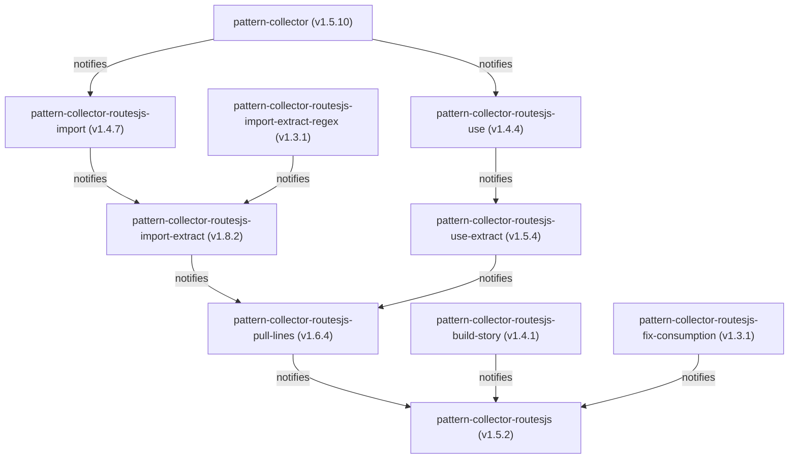

# Workspace Repositories Dependency & Workflow Analysis

This report analyzes the 10 connected repositories in the workspace, evaluating their package versions, dependency alignments, and GitHub Actions trigger dispatches.

---

## 1. Dependency & Dispatch Graph

Below is the updated dependency and GitHub Actions dispatch topology. Solid green lines indicate aligned dependency-to-dispatch paths.

---

## 2. Package & Registry Versions

| Repository / Folder Name | Package Name | Local Version | NPM Registry Version | Status | Dependencies Checked (Relative to Local) |
| :--- | :--- | :--- | :--- | :--- | :--- |
| `pattern-collector` | `pattern-collector` | `1.5.10` | `1.5.10` | ✅ Up to date | None |
| `pattern-collector-routesjs-import` | `pattern-collector-routesjs-import` | `1.4.7` | `1.4.7` | ✅ Up to date | `pattern-collector` (`^1.5.10`) ─ ✅ Matches local `1.5.10` |
| `pattern-collector-routesjs-use` | `pattern-collector-routesjs-use` | `1.4.4` | `1.4.4` | ✅ Up to date | `pattern-collector` (`^1.5.10`) ─ ✅ Matches local `1.5.10` |
| `pattern-collector-routesjs-import-extract-regex` | `pattern-collector-routesjs-import-extract-regex` | `1.3.1` | `1.2.1` | ⚠️ Local Ahead | None (No workspace dependencies) |
| `pattern-collector-routesjs-import-extract` | `pattern-collector-routesjs-import-extract` | `1.8.2` | `1.7.4` | ⚠️ Local Ahead | `pattern-collector-routesjs-import` (`^1.4.7`) ─ ✅ Matches local `1.4.7` `pattern-collector-routesjs-import-extract-regex` (`^1.2.1`) ─ ✅ Matches local `1.2.1` (or will use `1.3.1` once published) |
| `pattern-collector-routesjs-use-extract` | `pattern-collector-routesjs-use-extract` | `1.5.4` | `1.5.4` | ✅ Up to date | `pattern-collector-routesjs-use` (`^1.4.4`) ─ ✅ Matches local `1.4.4` |
| `pattern-collector-routesjs-pull-lines` | `pattern-collector-routesjs-pull-lines` | `1.6.4` | `1.6.4` | ✅ Up to date | `pattern-collector-routesjs-import-extract` (`^1.8.2`) ─ ⚠️ Matches `1.8.2` local, but should be updated to `^1.8.2` `pattern-collector-routesjs-use-extract` (`^1.5.4`) ─ ✅ Matches local `1.5.4` |
| `pattern-collector-routesjs-build-story` | `pattern-collector-routesjs-build-story` | `1.4.1` | `1.4.1` | ✅ Up to date | None |
| `pattern-collector-routesjs-fix-consumption` | `pattern-collector-routesjs-fix-consumption` | `1.3.1` | `1.3.1` | ✅ Up to date | `pattern-collector-routesjs-pull-lines` (`^1.6.4`) ─ ✅ Matches local `1.6.4` |
| `pattern-collector-routesjs` | `pattern-collector-routesjs` | `1.5.2` | *Not Published* | ℹ️ Private | `pattern-collector-routesjs-pull-lines` (`^1.6.4`) ─ ✅ Matches local `1.6.4` `pattern-collector-routesjs-build-story` (`^1.4.1`) ─ ✅ Matches local `1.4.1` |

---

## 3. Workflow Trigger Configuration

All NPM publication workflows (`publish-conditional.yml`) are configured to trigger on **manual `workflow_dispatch`** from the browser/GitHub UI. This allows manual control before executing a cascade publish, ensuring version bumps are explicitly verified.
