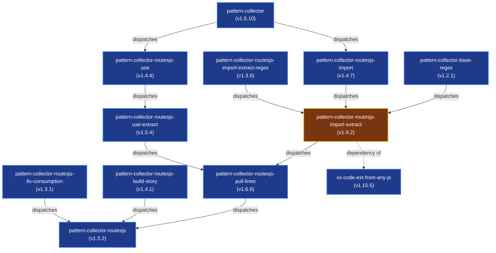

# Workspace Repositories Dependency & Workflow Analysis (Dashboard)

This dashboard provides an overview of the 12 micro-packages connected in the workspace. It highlights their dependencies, registry synchronization status, and automated cascading workflow paths.

---

## 1. Complete Dependency & Cascade Topology

Below is the complete graph showing package dependencies and GitHub Actions automated repository dispatch triggers.
- **Solid lines (`-->`):** Automated trigger cascade via `publish-conditional.yml` (manual trigger / push starts it, then dispatches downstream).
- **Dashed lines (`-.->`):** Peer/consumer NPM dependencies inside the workspace without trigger links.

---

## 2. Workspace Packages Summary

There are **12 packages** configured. The table below lists their local version, NPM registry version, status, and direct internal workspace dependencies.

| Folder / Repo Name | Package Name | Local | NPM Registry | Status | Workspace Dependencies |
| :--- | :--- | :--- | :--- | :--- | :--- |
| [pattern-collector](file:///d:/KeshavSoftRepos/2026-07-22(5)/pattern-collector) | `pattern-collector` | `1.5.10` | `1.5.10` | ✅ Up to date | None |
| [pattern-collector-base-regex](file:///d:/KeshavSoftRepos/2026-07-22(5)/pattern-collector-base-regex) | `pattern-collector-base-regex` | `1.2.1` | `1.2.1` | ✅ Up to date | None |
| [pattern-collector-routesjs](file:///d:/KeshavSoftRepos/2026-07-22(5)/pattern-collector-routesjs) | `pattern-collector-routesjs` | `1.5.2` | `1.5.2` | ✅ Up to date | [pattern-collector-routesjs-pull-lines](file:///d:/KeshavSoftRepos/2026-07-22(5)/pattern-collector-routesjs-pull-lines) (`^1.6.4`) [pattern-collector-routesjs-build-story](file:///d:/KeshavSoftRepos/2026-07-22(5)/pattern-collector-routesjs-build-story) (`^1.4.1`) |
| [pattern-collector-routesjs-build-story](file:///d:/KeshavSoftRepos/2026-07-22(5)/pattern-collector-routesjs-build-story) | `pattern-collector-routesjs-build-story` | `1.4.1` | `1.4.1` | ✅ Up to date | None |
| [pattern-collector-routesjs-fix-consumption](file:///d:/KeshavSoftRepos/2026-07-22(5)/pattern-collector-routesjs-fix-consumption) | `pattern-collector-routesjs-fix-consumption` | `1.3.1` | `1.3.1` | ✅ Up to date | [pattern-collector-routesjs-pull-lines](file:///d:/KeshavSoftRepos/2026-07-22(5)/pattern-collector-routesjs-pull-lines) (`^1.6.4`) |
| [pattern-collector-routesjs-import](file:///d:/KeshavSoftRepos/2026-07-22(5)/pattern-collector-routesjs-import) | `pattern-collector-routesjs-import` | `1.4.7` | `1.4.7` | ✅ Up to date | [pattern-collector](file:///d:/KeshavSoftRepos/2026-07-22(5)/pattern-collector) (`^1.5.10`) |
| [pattern-collector-routesjs-import-extract](file:///d:/KeshavSoftRepos/2026-07-22(5)/pattern-collector-routesjs-import-extract) | `pattern-collector-routesjs-import-extract` | `1.9.2` | `1.8.3` | ⚠️ Local Ahead | [pattern-collector-base-regex](file:///d:/KeshavSoftRepos/2026-07-22(5)/pattern-collector-base-regex) (`^1.2.1`) [pattern-collector-routesjs-import](file:///d:/KeshavSoftRepos/2026-07-22(5)/pattern-collector-routesjs-import) (`^1.4.7`) |
| [pattern-collector-routesjs-import-extract-regex](file:///d:/KeshavSoftRepos/2026-07-22(5)/pattern-collector-routesjs-import-extract-regex) | `pattern-collector-routesjs-import-extract-regex` | `1.3.6` | `1.3.6` | ✅ Up to date | None |
| [pattern-collector-routesjs-pull-lines](file:///d:/KeshavSoftRepos/2026-07-22(5)/pattern-collector-routesjs-pull-lines) | `pattern-collector-routesjs-pull-lines` | `1.6.6` | `1.6.6` | ✅ Up to date | [pattern-collector-routesjs-import-extract](file:///d:/KeshavSoftRepos/2026-07-22(5)/pattern-collector-routesjs-import-extract) (`^1.8.3`) [pattern-collector-routesjs-use-extract](file:///d:/KeshavSoftRepos/2026-07-22(5)/pattern-collector-routesjs-use-extract) (`^1.5.4`) |
| [pattern-collector-routesjs-use](file:///d:/KeshavSoftRepos/2026-07-22(5)/pattern-collector-routesjs-use) | `pattern-collector-routesjs-use` | `1.4.4` | `1.4.4` | ✅ Up to date | [pattern-collector](file:///d:/KeshavSoftRepos/2026-07-22(5)/pattern-collector) (`^1.5.10`) |
| [pattern-collector-routesjs-use-extract](file:///d:/KeshavSoftRepos/2026-07-22(5)/pattern-collector-routesjs-use-extract) | `pattern-collector-routesjs-use-extract` | `1.5.4` | `1.5.4` | ✅ Up to date | [pattern-collector-routesjs-use](file:///d:/KeshavSoftRepos/2026-07-22(5)/pattern-collector-routesjs-use) (`^1.4.4`) |
| [vs-code-ext-from-any-js](file:///d:/KeshavSoftRepos/2026-07-22(5)/vs-code-ext-from-any-js) | `vs-code-ext-from-any-js` | `1.15.5` | `1.15.5` | ✅ Up to date | [pattern-collector-routesjs-import-extract](file:///d:/KeshavSoftRepos/2026-07-22(5)/pattern-collector-routesjs-import-extract) (`^1.2.2`) |

---

## 3. Detailed Sub-Reports

To prevent a single markdown file from growing too large, detailed analyses have been separated into the following sub-reports:

1. 📂 **[Detailed Package Breakdown](file:///d:/KeshavSoftRepos/2026-07-22(5)/pattern-collector/package_details.md)**: Descriptions, dependencies, and local/registry status details for each package.
2. 🔄 **[Workflow & Dispatch Cascades](file:///d:/KeshavSoftRepos/2026-07-22(5)/pattern-collector/workflow_dispatch_analysis.md)**: Full analysis of GitHub Actions trigger methods, dispatch cascade loops, and event structures.
3. 🛠️ **[Propagation Troubleshooting Guide](file:///d:/KeshavSoftRepos/2026-07-22(5)/pattern-collector/propagation-troubleshooting.md)**: Diagnostic guidelines for silent curl workflow failures and token configuration.
