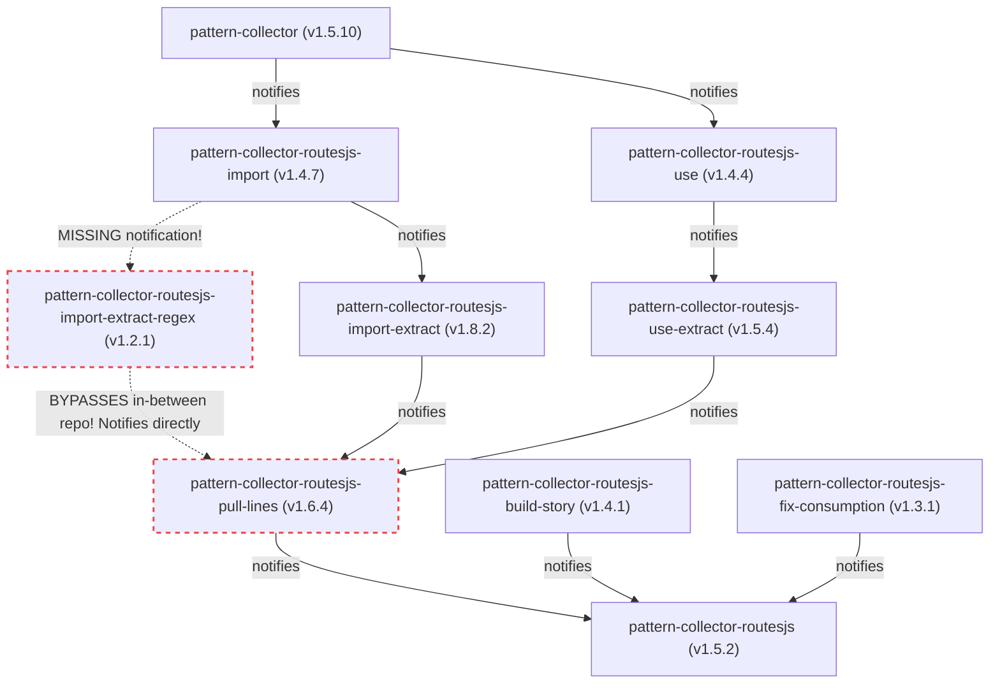

# Workspace Repositories Dependency & Workflow Analysis

This report analyzes the 10 connected repositories in the workspace, evaluating their package versions, dependency alignments, and GitHub Actions trigger dispatches.

---

## 1. Dependency & Dispatch Graph

Below is the dependency and GitHub Actions dispatch topology. Solid green lines indicate aligned dependency-to-dispatch paths, while dashed red lines show broken or bypassing links.



---

## 2. Package & Registry Versions

| Repository / Folder Name | Package Name | Local Version | NPM Registry Version | Status | Dependencies Checked (Relative to Local) |
| :--- | :--- | :--- | :--- | :--- | :--- |
| `pattern-collector` | `pattern-collector` | `1.5.10` | `1.5.10` | ✅ Up to date | None |
| `pattern-collector-routesjs-import` | `pattern-collector-routesjs-import` | `1.4.7` | `1.4.7` | ✅ Up to date | `pattern-collector` (`^1.5.10`) ─ ✅ Matches local `1.5.10` |
| `pattern-collector-routesjs-use` | `pattern-collector-routesjs-use` | `1.4.4` | `1.4.4` | ✅ Up to date | `pattern-collector` (`^1.5.10`) ─ ✅ Matches local `1.5.10` |
| `pattern-collector-routesjs-import-extract-regex` | `pattern-collector-routesjs-import-extract-regex` | `1.2.1` | `1.2.1` | ✅ Up to date | `pattern-collector-routesjs-import` (`^1.4.7`) ─ ✅ Matches local `1.4.7` |
| `pattern-collector-routesjs-import-extract` | `pattern-collector-routesjs-import-extract` | `1.8.2` | `1.7.4` | ⚠️ Local Ahead | `pattern-collector-routesjs-import` (`^1.4.7`) ─ ✅ Matches local `1.4.7`<br>`pattern-collector-routesjs-import-extract-regex` (`^1.2.1`) ─ ✅ Matches local `1.2.1` |
| `pattern-collector-routesjs-use-extract` | `pattern-collector-routesjs-use-extract` | `1.5.4` | `1.5.4` | ✅ Up to date | `pattern-collector-routesjs-use` (`^1.4.4`) ─ ✅ Matches local `1.4.4` |
| `pattern-collector-routesjs-pull-lines` | `pattern-collector-routesjs-pull-lines` | `1.6.4` | `1.6.4` | ✅ Up to date | `pattern-collector-routesjs-import-extract` (`^1.7.4`) ─ ⚠️ Matches `1.8.2` local, but should be updated to `^1.8.2`<br>`pattern-collector-routesjs-use-extract` (`^1.5.4`) ─ ✅ Matches local `1.5.4` |
| `pattern-collector-routesjs-build-story` | `pattern-collector-routesjs-build-story` | `1.4.1` | `1.4.1` | ✅ Up to date | None |
| `pattern-collector-routesjs-fix-consumption` | `pattern-collector-routesjs-fix-consumption` | `1.3.1` | `1.3.1` | ✅ Up to date | `pattern-collector-routesjs-pull-lines` (`^1.6.4`) ─ ✅ Matches local `1.6.4` |
| `pattern-collector-routesjs` | `pattern-collector-routesjs` | `1.5.2` | *Not Published* | ℹ️ Private | `pattern-collector-routesjs-pull-lines` (`^1.4.5`) ─ ⚠️ Actual is `1.6.4`, should update to `^1.6.4`<br>`pattern-collector-routesjs-build-story` (`^1.4.1`) ─ ✅ Matches local `1.4.1` |

---

## 3. Findings & Issues ("In-Between Only" Flow Violations)

### Issue A: Bypassing the In-Between Repository
* **Problem**: `pattern-collector-routesjs-import-extract-regex` has a workflow that notifies `pattern-collector-routesjs-pull-lines` directly.
* **Why this is wrong**: `pattern-collector-routesjs-import-extract` depends on `pattern-collector-routesjs-import-extract-regex` and sits **in-between** it and `pull-lines`. By notifying `pull-lines` directly, `import-extract` is completely bypassed and never updates its dependency on the regex package.
* **Impact**: Changes to the regex package never propagate into `import-extract` or onwards to downstream consumers.

### Issue B: Missing Notification for Regex Dependent
* **Problem**: `pattern-collector-routesjs-import` is not notifying `pattern-collector-routesjs-import-extract-regex` upon publishing or checking updates. It only notifies `pattern-collector-routesjs-import-extract`.
* **Impact**: If `import` changes, the regex package never learns about the update.

### Issue C: Incomplete dependency update commands
* **Problem**: `pattern-collector-routesjs-import-extract`'s `update-dependency.yml` does not install/update `pattern-collector-routesjs-import-extract-regex@latest`.

---

## 4. Proposed Fixes for "In-Between Only" Flow

To ensure each workflow **only notifies its immediate downstream (in-between) neighbors** in topological order, we should apply the following modifications:

### Step 1: Fix `pattern-collector-routesjs-import` Workflows
Modify `.github/workflows/publish-conditional.yml` and `.github/workflows/update-dependency.yml` to notify **only** the immediate next dependents. Since `import` is depended on by both `import-extract` and `import-extract-regex`, it should dispatch to both, or we can channel it sequentially to avoid race conditions:
* **Recommended Topological Sequential Path**: 
  `import` ➔ `import-extract-regex` ➔ `import-extract` ➔ `pull-lines`.
* **Changes**:
  * Update `pattern-collector-routesjs-import` to notify **only** `pattern-collector-routesjs-import-extract-regex`.
  * Update `pattern-collector-routesjs-import-extract-regex` to notify **only** `pattern-collector-routesjs-import-extract` (fixing the bypass).
  * Update `pattern-collector-routesjs-import-extract` to notify `pattern-collector-routesjs-pull-lines`.

### Step 2: Fix `pattern-collector-routesjs-import-extract-regex` Workflows
Modify `.github/workflows/publish-conditional.yml` and `.github/workflows/update-dependency.yml`:
* **Change**: Change the cURL dispatch URL from `/repos/keshavsoft/pattern-collector-routesjs-pull-lines/dispatches` to `/repos/keshavsoft/pattern-collector-routesjs-import-extract/dispatches`.

### Step 3: Fix `pattern-collector-routesjs-import-extract` Workflows
Modify `.github/workflows/update-dependency.yml`:
* **Change**: Add `pattern-collector-routesjs-import-extract-regex@latest` to the `npm install` step:
  ```bash
  npm install pattern-collector-routesjs-import@latest pattern-collector-routesjs-import-extract-regex@latest
  ```
